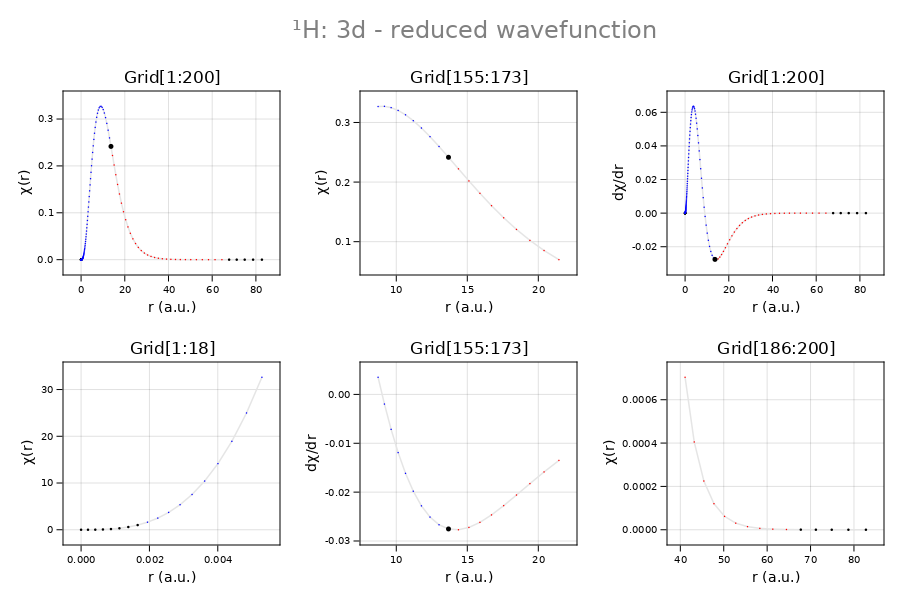
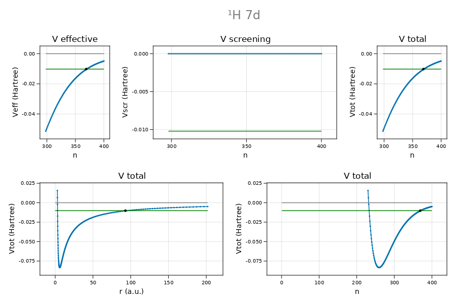

```@meta
CurrentModule = CamiXon
```

# CamiXon.jl

A package for image analysis of backscattered light

---
## Table of contents

```@contents
```

## Introduction

CamiXon is a package for the numerical solution of the radial Schrödinger
equation allowing for screening.

In this package the solution is obtained for a single electron, acting as a
*spectator* in the central field of the atomic nucleus screened by 'the other'
electrons (the *screening* electrons).

The starting point is the 1D Schrödinger equation,

```math
\tilde{χ}_{l}^{′′}+2[Z_{\mathrm{eff}}(ρ)/ρ-l(l+1)/2ρ^{2}+ε_{l}]\tilde{χ}_{l}=0,
```
where ``\tilde{\chi}_{l}(\rho)=\rho\tilde{R}_{l}(\rho)`` is the reduced
radial wavefunction and ``ε_{l}=-κ _{l}^{2}`` is the
corresponding binding energy in Hartree atomic units (a.u.). As compared
to the hydrogenic case, the atomic number ``Z`` has been replaced by
``Z_{\mathrm{eff}}(ρ)``, the *effective nuclear charge* at radial distance
``ρ`` from the atomic center (in a.u.). In other words, the energy of the
electron in the Coulomb field of the nucleus is replaced by an effective,
central field potential of the form

```math
U_{\mathrm{CF}}(ρ)=-Z_{\mathrm{eff}}(ρ)/ρ=-Z/ρ+U_{\mathrm{scr}}(ρ),
```

consisting of the bare Coulomb contribution, ``-Z/ρ``, and the screening field
``U_{\mathrm{scr}}(ρ)``, subject to the boundary conditions
``U_{\mathrm{scr}}(0)=Z`` and
``\mathrm{lim}_{ρ→\infty}U_{\mathrm{scr}}(ρ)=Z_{c}/ρ``.
Here ``Z_{c}`` is the Rydberg charge; i.e. the effective nuclear charge for a
spectator electron in the far field ``(ρ→\infty)``. Within these
assumptions we can optimize ``U_{\mathrm{scr}}(ρ)``, while preserving
the bare Coulomb field close to the nucleus as well as the Rydberg potential in
the far field. The price we pay is that the radial Schrödinger equation has to
be solved numerically by radial integration. Our strategy is to use both
*inward* and *outward* integration and match the two branches by
*equating the two solutions* for the *wavefunction*, ``χ(ρ)``, and its
*derivative*, ``χ^′(ρ)``, at a point near the classical turning point of the
radial motion of the electron. The basics of the solution can be found in the
book *Atomic Structure Theory* by Walter R. Johnson.

#### Illustration: the hydrogen 3d orbital

Shown below are the reduced radial wavefunction ``(χ)`` and its derivative
``(χ^′)`` in the near field (left), the far field (right), and in the region
near the classical turning point (center). 



## Codata

```@docs
Codata
Value
strValue(f::Value)
NamedValue
castNamedValue(val::Value; name=" ", comment=" ")
castCodata(year::Int)
listCodata(codata::Codata; msg=true)
convertUnit(val, codata; unitIn="Hartree", unitOut="xHz")
calibrationReport(E, Ecal, codata::Codata; unitIn="Hartree", msg=true)
```

## Atomic properties

### Element
```@docs
Element
castElement(;Z=1, msg=true)
listElement(Z::Int; fmt=Object)
listElements(Z1::Int, Z2::Int; fmt=Object)
```

### Isotope
```@docs
Isotope
castIsotope(;Z=1, A=1, msg=true)
listIsotope(Z::Int, A::Int; fmt=Object, msg=true)
listIsotopes(Z1::Int, Z2::Int; fmt=Object)
latexIsotopeTable(Z1::Int, Z2::Int; continuation=false)
```

### Atom
```@docs
Atom
castAtom(;Z=1, A=1, Q=0, msg=true)
listAtom(Z::Int, A::Int, Q::Int; fmt=Object)
listAtoms(Z1::Int, Z2::Int, Q::Int; fmt=Object)
```

### Orbital
```@docs
Orbit
castOrbit(;n=1, ℓ=0, mℓ=0, msg=true)
```

### Spinorbital
```@docs
Spinorbit
castSpinorbit(;n=1, ℓ=0, mℓ=0, up=true, msg=true)
```

### Term
```@docs
Term
castTerm(n::Int; ℓ=0, S=1//2, L=0, J=1//2, msg=true)
```
## Hydrogen

### Atomic properties

```@docs
bohrformula(Z::Int, n::Int)
hydrogenic_reduced_wavefunction(atom::Atom, orbit::Orbit, grid::CamiDiff.Grid{T}) where T<:Real
reduce_wavefunction(Z::Vector{Complex{T}}, grid::CamiDiff.Grid{T}) where T<:Real
restore_wavefunction(Z::Vector{Complex{T}}, atom::Atom, orbit::Orbit, grid::CamiDiff.Grid{T}) where T<:Real
```
#### Some special cases
```@docs
RH1s(Z::Int, r::T) where T<:Real
RH2s(Z::Int, r::T) where T<:Real
RH2p(Z::Int, r::T) where T<:Real
```

### Molecular properties
```@docs
silvera_goldman_triplet(r::T) where T<:Real
silvera_goldman_singlet(r::T) where T<:Real
silvera_goldman_exchange(r::T) where T<:Real
silvera_goldman_potential(grid::CamiDiff.Grid{T}; S=0) where T<:Real
rotbarrier(grid::CamiDiff.Grid{T}; ℓ=0) where T<:Real
```

## Thermodynamic properties
```@docs
melting_point(atomicnumber::Int)
svp(atomicnumber::Int, temp::Real)
latent_heat_vaporization(atomicnumber::Int, temp::Real)
```

## CamiDiff.Grid

The `CamiDiff.Grid` object is the backbone for the numerical procedure on a non-uniform
grid. Its principal fields are `grid.r` and `grid.r′`, which are discrete
functions of `N` elements representing the grid function and its derivative.

```@docs
autoRmax(atom::Atom, orbit::Orbit)
autoNtot(orbit::Orbit)
autoPrecision(Rmax::T, orbit::Orbit) where T<:Real
autoSteps(ID::Int, Ntot::Int, Rmax::T; p=5, polynom=[0,1]) where T<:Real
autoGrid(atom::Atom, orbit::Orbit, T::Type; p=0, polynom=[], Nboost=1, epn=5, k=7, msg=true)
```

## Def

The `Def` object serves to define the problem to be solved and to contain in
the field `def.Z` the solution as a discrete function of `N` elements.

```@docs
Def{T}
castDef(grid::CamiDiff.Grid{T}, atom::Atom, orbit::Orbit, codata::Codata; scr=nothing, msg=true) where T <: Real
```

## Pos

The `Pos` object serves within [`Def`](@ref) object to contain the position
indices `def.Na`, `def.Nb`, `def.Nlctp`, `def.Nmin`, `def.Nuctp` used in
Adams-Moulton integration. These positions are contained in the fields
`def.pos.Na`, `def.pos.Nb`, `def.pos.Nlctp`, `def.pos.Nmin`, `def.pos.Nuctp`.

```@docs
Pos
castPos(E::T, Veff::Vector{T}, grid::CamiDiff.Grid{T}) where T<:Real
updatePos!(pos::Pos, E::T, Veff::Vector{T}, grid::CamiDiff.Grid{T}) where T<:Real
```

#### Pos-related functions
```@docs
getNmin(f::Vector{T}, start::Int, stop::Int) where T<:Real
getNmax(f::Vector{T}, start::Int, stop::Int) where T<:Real
getNcut(f0::T, f::Vector{T}, start::Int, stop::Int) where T<:Real
getΔNcut(f0::T, f::Vector{T}, Ncut::Int, sense=fwd; ϵ = 1e-8, k = 7) where T<:Real
```

#### Illustration: central field potential ``U_{\mathrm{CF}}`` versus grid index
```
codata = castCodata(2018)
atom = castAtom(Z=1, A=1, Q=0)
orbit = castOrbit(n=7, ℓ=2)
grid = autoGrid(atom, orbit, Float64)
def = castDef(grid, atom, orbit, codata)
E = convert(grid.T,bohrformula(atom.Z, orbit.n))
adams = castAdams(E, grid, def)
@printf "E = %.15g %s \n" E "Hartree"
    Element created: H, hydrogen, Z=1, weight=1.008
    Isotope created: ¹H, hydrogen, Z=1, A=1, N=0, R=0.8783, M=1.007825032, I=1/2⁺, μI=2.792847351, Q=0.0, RA=99.9855%, (stable)
    Atom created: hydrogen, neutral atom, ¹H, Z=1, A=1, Q=0, Zc=1
    Orbital: 7d
        principal quantum number: n = 7
        radial quantum number: n′ = 4 (number of nodes in radial wavefunction)
        orbital angular momentum of valence electron: ℓ = 2
    CamiDiff.Grid created: exponential, Float64, Rmax = 207.0 a.u., Ntot = 400, h = 0.025, r0 = 0.00939821
    Def created for hydrogen 7d on exponential grid of 400 points
    E = -0.0102040816326531 Hartree

plot_potentials(E, grid, def)
    Nlctp = 234, Nmin = 259, Nuctp = 369 (Ructp = 93.0059202490 a.u.)
```
The plot is made using `CairomMakie`.
NB.: `plot_potentials` is not included in the `CamiXon` package.


## Adams-Moulton integration

The Adams-Moulton method is used for numerical integration of the reduces
radial wave equation. In the present implementation it is constructed on top
the objects [`Atom`](@ref), [`Orbit`](@ref), [`CamiDiff.Grid`](@ref), [`Def`](@ref)
and [`Adams`](@ref) using 5 globally defined instances called `atom`, `orbit`,
`grid`, `def` and `adams`.

### Adams

The `Adams` object serves to hold the Adams-Moulton integration matrices
`matG`, `matσ`, `matMinv` as well as the *actual* normalized solution `Z` in
the form of a tabulated function of `N` elements.

```@docs
Adams
castAdams(E::T, grid::CamiDiff.Grid{T}, def::Def{T}) where T<:Real
updateAdams!(adams::Adams{T}, E::T, grid::CamiDiff.Grid{T}, def::Def{T}) where T<:Real
```

#### Adams related functions

```@docs
matG(E::T, grid::CamiDiff.Grid{T}, def::Def{T}) where T<:Real
matσ(E::T, grid::CamiDiff.Grid{T}, def::Def{T}) where T<:Real
matMinv(E::T, grid::CamiDiff.Grid{T}, def::Def{T}) where T<:Real
```

#### Adams-Moulton numerical solution of the radial wave equation
```@docs
Init{T} where T<:Real
adams_moulton_solve!(Z::Vector{Complex{T}}, E::T, grid::CamiDiff.Grid{T}, def::Def{T}, adams::Adams{T}) where T<:Real
adams_moulton_solve_refine!(Z::Vector{Complex{T}}, E::T, grid::CamiDiff.Grid{T}, def::Def{T}, adams::Adams{T}) where T<:Real
```

#### Radial integration - outward
```@docs
OUTSCH!(Z::Vector{Complex{T}}, E::T, grid::CamiDiff.Grid{T}, def::Def{T}, adams::Adams{T}) where T<:Real
OUTSCH_WJ!(Z::Vector{Complex{T}}, grid::CamiDiff.Grid{T}, def::Def{T}, adams::Adams{T}) where T<:Real
OUTSCH_WKB!(Z::Vector{Complex{T}}, E::T, grid::CamiDiff.Grid{T}, def::Def{T}) where T<:Real
adams_moulton_outward!(Z::Vector{Complex{T}}, def::Def{T}, adams::Adams{T}) where T<:Real
```

#### Radial integration - inward
```@docs
INSCH!(Z::Vector{Complex{T}}, E::T, grid::CamiDiff.Grid{T}, def::Def{T}) where T<:Real
INSCH_WKB!(Z::Vector{Complex{T}}, E::T, grid::CamiDiff.Grid{T}, def::Def{T}) where T<:Real
adams_moulton_inward!(Z::Vector{Complex{T}}, def::Def{T}, adams::Adams{T}) where T<:Real
```

#### Radial integration - boundary condition applied and convergence test
```@docs
adams_moulton_normalize!(Z::Vector{Complex{T}}, ΔQ::T, grid::CamiDiff.Grid{T}, def::Def{T}) where T<:Real
```

#### Adams-Moulton Master procedures
```@docs
adams_moulton_nodes(E::Real, scr::Vector{T}, grid::CamiDiff.Grid{T}, def::Def{T}; imax=25, msg=true) where T<:Real
adams_moulton_iterate!(Z::Vector{Complex{T}}, init::Init{T}, grid::CamiDiff.Grid{T}, def::Def{T}, adams::Adams{T}; imax=25, ϵ=1e-6, msg=true) where T<:Real
adams_moulton_precise!(Z, init, grid, def; imax=10, ϵ=1e-6, msg=false)
adams_moulton_report(E::T, ΔE::T, grid::CamiDiff.Grid{T}, def::Def{T}; unitIn="Hartree", name="name" , msg=true) where T<:Real
```

## Coulomb integrals

### Angular integrals

```@docs
a_direct(k::Int, l::Int, ml::Int, l′::Int, ml′::Int)
b_exchange(k::Int, l::Int, ml::Int, l′::Int, ml′::Int)
UF(k::Int, F::Vector{T}, grid::CamiDiff.Grid{V}) where {T<:Real, V<:Real}
UG(k::Int, P1::Vector{T}, P2::Vector{T}, grid::CamiDiff.Grid{V}) where {T<:Real, V<:Real}
```

## Julia tools

```@docs
primitivetype(T::Type)
lc_primitivetype(o::Any)
lc_eltype(o)
bigconvert(o)
conditionalType(n::T, nc::Int; msg=true) where {T<:Integer}
find_all(A::Union{String,AbstractArray{T,1}}, a::T...; count=false)  where T
find_first(A::Union{String,AbstractArray{T,1}}, a::T...; dict=false)  where T
find_last(A::Union{String,AbstractArray{T,1}}, a::T...; dict=false)  where T
```


## Dicts

```@docs
dictAntoineCoefficients
dictAtomicNumbers
dictBigConversion
dictElements
dictIsotopes
dictMeltingPoints
```

## Index

```@index
```
